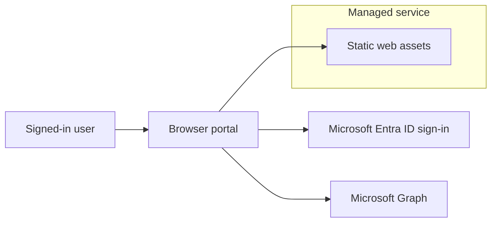

# Entra Extensions Manager

[](https://github.com/Noble-Effeciency13/EntraExtensionManager/actions/workflows/ci.yml)
[](https://github.com/Noble-Effeciency13/EntraExtensionManager/releases/latest)

[](https://github.com/Noble-Effeciency13/EntraExtensionManager/blob/main/LICENSE)


<p align="center">
  <a href="https://www.buymeacoffee.com/chanceofsecurity"></a>
</p>

Entra Extensions Manager is a managed, browser-based portal for discovering, reviewing, and managing Microsoft Entra ID extension definitions through Microsoft Graph.

The portal is designed for administrators and identity engineers who need a safer, clearer way to work with **schema extensions**, **directory extensions**, and **open extensions** without building one-off Graph scripts for every task.

## Table of contents

- [What the portal does](#what-the-portal-does)
    - [Extension inventory](#extension-inventory)
    - [Schema extension management](#schema-extension-management)
    - [Directory extension management](#directory-extension-management)
    - [Open extension management](#open-extension-management)
    - [Tools](#tools)
    - [Personalization and productivity](#personalization-and-productivity)
    - [Demo mode](#demo-mode)
- [Architecture](#architecture)
- [Authentication model](#authentication-model)
    - [Tenant switcher](#tenant-switcher)
- [Data handling and privacy](#data-handling-and-privacy)
- [Permissions and roles](#permissions-and-roles)
    - [Delegated Graph permissions](#delegated-graph-permissions)
    - [Suggested Microsoft Entra roles](#suggested-microsoft-entra-roles)
- [Self-hosting](#self-hosting)
    - [Microsoft Entra app registration](#microsoft-entra-app-registration)
    - [Downloadable release package](#downloadable-release-package)
    - [Runtime configuration](#runtime-configuration)
    - [Building from source](#building-from-source)
    - [Hosting and routing](#hosting-and-routing)
- [Security boundaries](#security-boundaries)
- [Microsoft Graph behavior to be aware of](#microsoft-graph-behavior-to-be-aware-of)
- [Support-safe diagnostics](#support-safe-diagnostics)
- [Further reading](#further-reading)

## What the portal does

### Extension inventory

- Lists schema extensions and directory extensions in a single experience.
- Shows extension type, target object types, owner/application context, status, data type, and properties.
- Provides filtering, searching, and expandable details for investigation and documentation.
- Surfaces open extensions separately, on a per-object basis, since they are not registered tenant-wide.

### Schema extension management

- Creates schema extension definitions.
- Edits schema extension details where Microsoft Graph allows edits.
- Promotes schema extensions through their supported lifecycle states.
- Deletes schema extensions where deletion is supported.
- Surfaces Microsoft Graph limitations and one-way lifecycle transitions before changes are made.

### Directory extension management

- Displays directory extensions from application `extensionProperties`.
- Creates new directory extension definitions for supported target object types.
- Deletes directory extension definitions where Microsoft Graph allows deletion.
- Identifies read-only or synced-from-on-premises extension definitions.

### Open extension management

- Manages **open extensions** (`openTypeExtension`) on Users, Groups, Devices, and the Organization object.
- Because open extensions are stored on individual objects rather than registered tenant-wide, the area is object-scoped: you select a resource type and an object to work with the open extensions held on it.
- Finds objects with a **type-ahead directory search** — start typing a name, user principal name, or mail and matching users, groups, or devices appear as you go. A pasted object id or UPN can also be looked up directly. The Organization object loads automatically.
- Shows each open extension's stored data, and (in edit mode) creates, edits, and deletes open extensions. The create dialog presents a clearly marked example JSON object to illustrate the expected shape.

### Tools

- **Usage monitor** — probes supported directory object types to estimate where extension values are present, and lets you expand any extension to drill into the actual objects that hold a value and the data stored. The object list is masked by default with a reveal toggle, pages on demand, and can be exported to CSV or JSON. It also flags **deprecated definitions that still hold values**, so you can plan a migration before removing them.
- **Validate value** — tests whether proposed extension values match the extension definition and target object behavior.
- **Manifest snippet** — generates ready-to-use snippets for each definition: a Microsoft Graph **JSON** body, a **Microsoft Graph PowerShell** command, the **app registration manifest** shape (directory extensions), and a raw **HTTP** request.
- **Audit log** — helps find extension-related directory audit events.

### Personalization and productivity

- **Skins** — restyle the entire portal with one of five themes (Fluent, Retro, 8-bit, Synthwave, Newsprint), each with light and dark variants. Your choice is remembered.
- **Command palette** — press <kbd>Ctrl</kbd>/<kbd>⌘</kbd> + <kbd>K</kbd> to jump to any page, switch skin/theme/mode, start a tour, or run demo actions.
- **Guided tours** — a Help (`?`) button gives every page a fresh walkthrough that spotlights the relevant controls. It works in both the demo and a real tenant, and only auto-runs once when you enter the demo.
- **Keyboard shortcuts** — <kbd>/</kbd> focus search, <kbd>n</kbd> new, <kbd>e</kbd> toggle Edit mode, <kbd>?</kbd> About (which lists every shortcut).

### Demo mode

- **Explore without signing in** — the landing page offers a one-click live demo backed by a fully simulated tenant (sample schema, directory, and open extensions, plus usage and audit data). Nothing is ever sent to Microsoft Graph.
- All write actions (create, assign, edit, delete) are simulated against an in-memory store, so the portal behaves like a real tenant for the browser session.
- **Reset demo data** restores the original sample tenant. **Sign in to a real tenant** leaves the demo for a real Entra sign-in — a one-way door, with no path from a real session back into the demo.

## Architecture

Entra Extensions Manager is intentionally built as a **browser-only** application.



The managed service provides the static portal assets. After the portal loads, Microsoft Entra authentication and Microsoft Graph data access happen directly from the user's browser.

There is no application-owned runtime service that receives, proxies, stores, or processes tenant data.

## Authentication model

- Authentication uses Microsoft Entra ID.
- The portal uses delegated Microsoft Graph permissions.
- The signed-in user remains the security principal for Graph operations.
- Read mode starts with read-oriented Graph permissions.
- Edit mode requests elevated delegated Graph permissions only when the user switches into edit mode.
- Conditional Access, tenant consent policies, MFA requirements, and user assignment policies continue to apply.
- The portal does not use client secrets or application permissions.
- The portal authenticates against the Microsoft Entra `organizations` endpoint, allowing users from any Azure AD tenant to sign in.

### Tenant switcher

The header includes a **Tenant switcher** button that allows the signed-in user to work across multiple Azure AD tenants without signing out.

- On sign-in, the portal silently fetches all tenant memberships for the signed-in user using the Azure Management API (`management.azure.com/tenants`). This requires the `https://management.azure.com/user_impersonation` delegated scope — the first time this is used, a one-time consent prompt appears when the user opens the switcher.
- The list of tenants is ready before the switcher is opened. If the management scope has not yet been consented, the switcher offers a **Grant access to list tenants** option that triggers the consent popup on demand (browser popup-blocker safe).
- **Switching to a previously visited tenant** sets the cached MSAL account as active immediately — no popup or re-authentication required.
- **Switching to a new tenant** opens a Microsoft Entra login popup for that tenant. If the app has not yet been granted access there, the standard Entra consent screen is shown for that tenant only.
- All Microsoft Graph API calls automatically target the active tenant after a switch.

## Data handling and privacy

The portal is designed not to retain tenant data.

- No backend service stores tenant, user, application, extension, directory, or audit log data.
- No database is used for portal data.
- No storage account is used for portal data.
- No server-side cache is used.
- No telemetry endpoint receives tenant data.
- No Microsoft Graph data is persisted by the portal.

Data is collected from Microsoft Graph when a user opens a page or runs a tool. Results are held only as transient browser state needed to render the current experience.

Browser-local state is limited to:

- MSAL authentication state and access tokens in browser `sessionStorage`.
- Basic UI preferences in browser `localStorage`, such as theme and read/edit mode preference.
- Transient in-memory UI state while views are active.

All Microsoft Graph requests are made from the browser using the signed-in user's delegated access token.

## Permissions and roles

Actual access is determined by both:

1. Microsoft Graph delegated permissions granted to the portal.
2. The signed-in user's Microsoft Entra roles, directory permissions, Conditional Access policies, and tenant consent settings.

### Delegated Graph permissions

| Portal area | Delegated Microsoft Graph permissions |
| --- | --- |
| Sign-in | `User.Read` |
| Extension inventory and read-only tools | `Application.Read.All`, `Directory.Read.All` |
| Open extension lookup and directory object search | `Directory.Read.All` |
| Audit log tool | `AuditLog.Read.All` |
| Schema and directory extension changes | `Application.ReadWrite.All`, `Directory.ReadWrite.All` |
| Open extension changes | `Directory.ReadWrite.All` |

Admin consent is typically required for the directory-wide permissions.

The **tenant switcher** additionally uses the **Azure Service Management** delegated permission `user_impersonation` (`https://management.azure.com/user_impersonation`) to enumerate the signed-in user's tenant memberships. This is not a Microsoft Graph permission; consent is requested on demand the first time the switcher is used.

### Suggested Microsoft Entra roles

The exact role needed can vary by tenant policy and the specific operation, but these are common guidelines.

| Use case | Commonly appropriate roles |
| --- | --- |
| View extension definitions and directory metadata | Global Reader, Directory Reader, Application Reader, Application Administrator, Cloud Application Administrator, or Global Administrator |
| Read audit log information | Reports Reader, Security Reader, Global Reader, Security Administrator, or Global Administrator |
| Manage app registrations and directory extension definitions | Application Administrator, Cloud Application Administrator, or Global Administrator |
| Manage schema extension definitions | Application Administrator, Cloud Application Administrator, or Global Administrator |
| Grant tenant-wide admin consent | Global Administrator, Privileged Role Administrator, Cloud Application Administrator, or Application Administrator, depending on tenant policy and requested permissions |

For least privilege, users should normally work in read mode and switch to edit mode only when they intend to make a change.

## Self-hosting

The hosted portal is the recommended experience, but the project can also be self-hosted by downloading the source code and publishing it to a static web host.

Self-hosting keeps the same browser-only security model:

- The app still runs entirely in the browser.
- No backend API is required.
- No client secret is used.
- Microsoft Graph calls still use delegated permissions for the signed-in user.
- Tenant data is still fetched directly from Microsoft Graph and is not persisted by the app.

### Microsoft Entra app registration

Self-hosting requires your own Microsoft Entra app registration.

1. Go to **Microsoft Entra admin center → App registrations → New registration**.
2. **Supported account types:**
   - Choose **Accounts in any organizational directory (multitenant)** for the full cross-tenant experience, so the tenant switcher can add other tenants.
   - Choose **single tenant** if only users from your own tenant should ever sign in.
3. Under **Authentication → Add a platform → Single-page application (SPA)**, add your hosted URL as a **Redirect URI** (for example `https://extensions.contoso.com`). It must match the app's origin exactly. Do **not** use the "Web" platform and do **not** create a client secret — the portal uses the authorization code flow with PKCE.
4. Under **API permissions → Add a permission**, add these **delegated** permissions:
   - **Microsoft Graph:** `User.Read`, `Application.Read.All`, `Directory.Read.All`, `AuditLog.Read.All`, `Application.ReadWrite.All`, `Directory.ReadWrite.All`.
   - **Azure Service Management:** `user_impersonation` — required by the tenant switcher, which calls `management.azure.com/tenants`. Omit only if you do not need cross-tenant switching.
5. Grant **admin consent** for the directory-wide permissions to avoid per-user consent prompts.
6. Copy the **Application (client) ID** — you will place it in `config.js` (release package) or `VITE_AAD_CLIENT_ID` (source build).

### Downloadable release package

Each GitHub release can include a ZIP asset named like `entra-extensions-manager-v1.0.0.zip`. Downloads of that release asset are counted by the downloads badge at the top of this README.

To self-host from a release package:

1. Download the ZIP from the GitHub release.
2. Extract the ZIP.
3. Edit `config.js` with your Entra app registration values.
4. Upload the extracted files to your static web host.
5. Register the final hosted URL as a SPA redirect URI in your Entra app registration.

> **Important:** you must edit `config.js`. If the `aadClientId` placeholder is left unchanged, a release build has no build-time fallback and sign-in fails with `AADSTS900144: The request body must contain the following parameter: 'client_id'`.

GitHub's automatically generated **Source code** ZIP/TAR downloads are not counted by the release downloads badge. The badge counts uploaded release assets, such as the self-hostable ZIP package.

### Runtime configuration

The release package includes a `config.js` file that is read at runtime, so you can change it after build time without rebuilding:

```js
window.__EEM_CONFIG__ = {
  aadClientId: 'your-application-client-id',
  aadTenantId: '__VITE_AAD_TENANT_ID__', // present for compatibility; ignored
  aadRedirectUri: 'https://extensions.contoso.com',
};
```

| Configuration | Purpose |
| --- | --- |
| `aadClientId` | Application/client ID from your Entra app registration. Required. |
| `aadRedirectUri` | HTTPS URL where your self-hosted portal is served. If omitted, the browser origin is used. Must match a registered SPA redirect URI. |

> **Note:** `aadTenantId` remains in the file for backward compatibility but is ignored. Authentication always targets the `organizations` endpoint so users from any Azure AD tenant can sign in. The tenant switcher handles per-tenant context at runtime. Any value still left in the build placeholder form (wrapped in leading and trailing double underscores, such as `__VITE_AAD_CLIENT_ID__`) is treated as unset.

### Building from source

Self-hosters who prefer to build from source can set the equivalent Vite build-time values instead:

| Build variable | Purpose |
| --- | --- |
| `VITE_AAD_CLIENT_ID` | Application/client ID from your Entra app registration. |
| `VITE_AAD_REDIRECT_URI` | HTTPS URL where your self-hosted portal is served. |

> **Note:** `VITE_AAD_TENANT_ID` is no longer used. Authentication always targets the `organizations` endpoint.

Copy `.env.example` to `.env.local`, set the values, then run `npm ci` and `npm run build`. The build output in `dist/` is the self-hostable static site.

### Hosting and routing

The app is a single-page application, so the host must serve `index.html` for unknown routes.

- **Azure Static Web Apps:** the included `staticwebapp.config.json` provides the `index.html` navigation fallback and a baseline set of security headers (`X-Content-Type-Options`, `Referrer-Policy`, `X-Frame-Options`, `Permissions-Policy`). No extra configuration is needed.
- **Other hosts (nginx, Azure Storage static websites, Amazon S3/CloudFront, GitHub Pages, etc.):** `staticwebapp.config.json` is ignored. Configure your host to fall back to `/index.html` for unmatched routes, serve everything over HTTPS, and — if you want the same hardening — replicate the security headers from `staticwebapp.config.json`.

The release package assumes the portal is hosted at the root of an HTTPS origin, such as `https://extensions.contoso.com/`. For production use, host over HTTPS and register the exact HTTPS origin as a SPA redirect URI in Entra ID.

## Security boundaries

- The portal cannot bypass Microsoft Graph authorization.
- The portal cannot elevate a user beyond their granted delegated permissions and Entra roles.
- Edit actions require the user to explicitly switch into edit mode.
- Microsoft Graph request IDs are surfaced where possible to support tenant-side troubleshooting.
- Access tokens should never be copied into support requests, issues, screenshots, or logs.

## Microsoft Graph behavior to be aware of

- Schema extensions can transition `InDevelopment` → `Available` → `Deprecated` only in one direction.
- After a schema extension becomes `Available`, properties and target types are locked; only description remains editable.
- Directory extensions are created and deleted through an application's `extensionProperties` collection.
- Microsoft Graph does not support PATCH updates for directory extension definitions. Replacing one requires delete/recreate behavior and may affect existing values.
- Some usage checks rely on Microsoft Graph `$count` and advanced query support. Unsupported target types are skipped by design.
- The Usage monitor object drill-down lists objects with the same advanced-query support (`$filter ... ne null` with `$count` and `ConsistencyLevel: eventual`) and pages results on demand; target types that do not support it are not offered.
- Open extensions are stored per object and are not enumerable tenant-wide — there is no Graph endpoint that lists every open extension in a tenant — so the portal works with them one object at a time rather than as a global inventory.
- Directory object search uses Microsoft Graph `$search` with `ConsistencyLevel: eventual`, is debounced, and requires at least two characters to limit request volume.

## Support-safe diagnostics

When reporting an issue, useful details include:

- The portal area or tool being used.
- The selected mode: read or edit.
- The sanitized Microsoft Graph error code/message.
- Browser name and version.

Do not share access tokens, client secrets, unsanitized audit log exports, or sensitive tenant/user/object identifiers unless you are certain they are safe to disclose.

## Further reading

- **[Choosing the Right Extension Type in Microsoft Entra](https://www.chanceofsecurity.com/post/choosing-the-right-extension-type-in-microsoft-entra)** — not sure whether to use a schema extension, directory extension, or open extension? This article walks through the differences, tradeoffs, and when to reach for each type.
- **Entra Extensions Manager — a walkthrough** *(article coming soon)* — a hands-on look at using this portal to manage extension attributes in a real Entra tenant.
