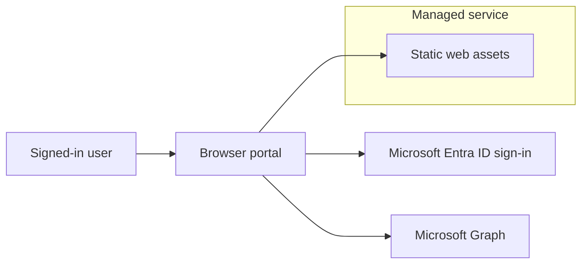

# Entra Extensions Manager

Entra Extensions Manager is a managed, browser-based portal for discovering, reviewing, and managing Microsoft Entra ID extension definitions through Microsoft Graph.

The portal is designed for administrators and identity engineers who need a safer, clearer way to work with **schema extensions** and **directory extensions** without building one-off Graph scripts for every task.

## Table of contents

- [What the portal does](#what-the-portal-does)
    - [Extension inventory](#extension-inventory)
    - [Schema extension management](#schema-extension-management)
    - [Directory extension management](#directory-extension-management)
    - [Tools](#tools)
- [Architecture](#architecture)
- [Authentication model](#authentication-model)
- [Data handling and privacy](#data-handling-and-privacy)
- [Permissions and roles](#permissions-and-roles)
    - [Delegated Graph permissions](#delegated-graph-permissions)
    - [Suggested Microsoft Entra roles](#suggested-microsoft-entra-roles)
- [Self-hosting](#self-hosting)
    - [Downloadable release package](#downloadable-release-package)
    - [Runtime configuration](#runtime-configuration)
    - [Building from source](#building-from-source)
- [Security boundaries](#security-boundaries)
- [Microsoft Graph behavior to be aware of](#microsoft-graph-behavior-to-be-aware-of)
- [Support-safe diagnostics](#support-safe-diagnostics)

## What the portal does

### Extension inventory

- Lists schema extensions and directory extensions in a single experience.
- Shows extension type, target object types, owner/application context, status, data type, and properties.
- Provides filtering, searching, and expandable details for investigation and documentation.

### Schema extension management

- Creates schema extension definitions.
- Edits schema extension details where Microsoft Graph allows edits.
- Promotes schema extensions through their supported lifecycle states.
- Deletes schema extensions where deletion is supported.
- Surfaces Microsoft Graph limitations and one-way lifecycle transitions before changes are made.

### Directory extension management

- Displays directory extensions from application `extensionProperties`.
- Creates new directory extension definitions for supported target object types.
- Deletes directory extension definitions where Microsoft Graph allows deletion.
- Identifies read-only or synced-from-on-premises extension definitions.

### Tools

- **Usage monitor** — probes supported directory object types to estimate where extension values are present.
- **Validate value** — tests whether proposed extension values match the extension definition and target object behavior.
- **Manifest snippet** — generates app manifest snippets for extension definitions.
- **Audit log** — helps find extension-related directory audit events.

## Architecture

Entra Extensions Manager is intentionally built as a **browser-only** application.

The managed service provides the static portal assets. After the portal loads, Microsoft Entra authentication and Microsoft Graph data access happen directly from the user's browser.

There is no application-owned runtime service that receives, proxies, stores, or processes tenant data.

## Authentication model

- Authentication uses Microsoft Entra ID.
- The portal uses delegated Microsoft Graph permissions.
- The signed-in user remains the security principal for Graph operations.
- Read mode starts with read-oriented Graph permissions.
- Edit mode requests elevated delegated Graph permissions only when the user switches into edit mode.
- Conditional Access, tenant consent policies, MFA requirements, and user assignment policies continue to apply.
- The portal does not use client secrets or application permissions.

## Data handling and privacy

The portal is designed not to retain tenant data.

- No backend service stores tenant, user, application, extension, directory, or audit log data.
- No database is used for portal data.
- No storage account is used for portal data.
- No server-side cache is used.
- No telemetry endpoint receives tenant data.
- No Microsoft Graph data is persisted by the portal.

Data is collected from Microsoft Graph when a user opens a page or runs a tool. Results are held only as transient browser state needed to render the current experience.

Browser-local state is limited to:

- MSAL authentication state and access tokens in browser `sessionStorage`.
- Basic UI preferences in browser `localStorage`, such as theme and read/edit mode preference.
- Transient in-memory UI state while views are active.

All Microsoft Graph requests are made from the browser using the signed-in user's delegated access token.

## Permissions and roles

Actual access is determined by both:

1. Microsoft Graph delegated permissions granted to the portal.
2. The signed-in user's Microsoft Entra roles, directory permissions, Conditional Access policies, and tenant consent settings.

### Delegated Graph permissions

| Portal area | Delegated Microsoft Graph permissions |
| --- | --- |
| Sign-in | `User.Read` |
| Extension inventory and read-only tools | `Application.Read.All`, `Directory.Read.All` |
| Audit log tool | `AuditLog.Read.All` |
| Schema and directory extension changes | `Application.ReadWrite.All`, `Directory.ReadWrite.All` |

Admin consent is typically required for the directory-wide permissions.

### Suggested Microsoft Entra roles

The exact role needed can vary by tenant policy and the specific operation, but these are common guidelines.

| Use case | Commonly appropriate roles |
| --- | --- |
| View extension definitions and directory metadata | Global Reader, Directory Reader, Application Reader, Application Administrator, Cloud Application Administrator, or Global Administrator |
| Read audit log information | Reports Reader, Security Reader, Global Reader, Security Administrator, or Global Administrator |
| Manage app registrations and directory extension definitions | Application Administrator, Cloud Application Administrator, or Global Administrator |
| Manage schema extension definitions | Application Administrator, Cloud Application Administrator, or Global Administrator |
| Grant tenant-wide admin consent | Global Administrator, Privileged Role Administrator, Cloud Application Administrator, or Application Administrator, depending on tenant policy and requested permissions |

For least privilege, users should normally work in read mode and switch to edit mode only when they intend to make a change.

## Self-hosting

The hosted portal is the recommended experience, but the project can also be self-hosted by downloading the source code and publishing it to a static web host.

Self-hosting keeps the same browser-only security model:

- The app still runs entirely in the browser.
- No backend API is required.
- No client secret is used.
- Microsoft Graph calls still use delegated permissions for the signed-in user.
- Tenant data is still fetched directly from Microsoft Graph and is not persisted by the app.

Self-hosting requires your own Microsoft Entra app registration configured as a **Single-page application**. The redirect URI must match the URL where you host the app.

### Downloadable release package

Each GitHub release can include a ZIP asset named like `entra-extensions-manager-v1.0.0.zip`. Downloads of that release asset are counted by the downloads badge at the top of this README.

To self-host from a release package:

1. Download the ZIP from the GitHub release.
2. Extract the ZIP.
3. Edit `config.js` with your Entra app registration values.
4. Upload the extracted files to your static web host.
5. Register the final hosted URL as a SPA redirect URI in your Entra app registration.

GitHub's automatically generated **Source code** ZIP/TAR downloads are not counted by the release downloads badge. The badge counts uploaded release assets, such as the self-hostable ZIP package.

### Runtime configuration

| Configuration | Purpose |
| --- | --- |
| `aadClientId` | Application/client ID from your Entra app registration. |
| `aadTenantId` | `organizations`, `common`, or a specific tenant ID. |
| `aadRedirectUri` | HTTPS URL where your self-hosted portal is served. If omitted, the browser origin is used. |

The release package includes a `config.js` file for these values. It can be changed after build time, so self-hosters do not need to rebuild the app just to use their own Entra app registration.

### Building from source

Self-hosters who prefer to build from source can set the equivalent Vite build-time values instead:

| Build variable | Purpose |
| --- | --- |
| `VITE_AAD_CLIENT_ID` | Application/client ID from your Entra app registration. |
| `VITE_AAD_TENANT_ID` | `organizations`, `common`, or a specific tenant ID. |
| `VITE_AAD_REDIRECT_URI` | HTTPS URL where your self-hosted portal is served. |

The app builds to static files and can be hosted on static hosting platforms such as Azure Static Web Apps, Azure Storage static websites, GitHub Pages, or equivalent services. For production use, host it over HTTPS and register the exact HTTPS URL as a SPA redirect URI in Entra ID.

The release package assumes the portal is hosted at the root of an HTTPS origin, such as `https://extensions.contoso.com/`, with unknown routes falling back to `index.html`. Azure Static Web Apps uses the included `staticwebapp.config.json` for that fallback behavior.

## Security boundaries

- The portal cannot bypass Microsoft Graph authorization.
- The portal cannot elevate a user beyond their granted delegated permissions and Entra roles.
- Edit actions require the user to explicitly switch into edit mode.
- Microsoft Graph request IDs are surfaced where possible to support tenant-side troubleshooting.
- Access tokens should never be copied into support requests, issues, screenshots, or logs.

## Microsoft Graph behavior to be aware of

- Schema extensions can transition `InDevelopment` → `Available` → `Deprecated` only in one direction.
- After a schema extension becomes `Available`, properties and target types are locked; only description remains editable.
- Directory extensions are created and deleted through an application's `extensionProperties` collection.
- Microsoft Graph does not support PATCH updates for directory extension definitions. Replacing one requires delete/recreate behavior and may affect existing values.
- Some usage checks rely on Microsoft Graph `$count` and advanced query support. Unsupported target types are skipped by design.

## Support-safe diagnostics

When reporting an issue, useful details include:

- The portal area or tool being used.
- The selected mode: read or edit.
- The sanitized Microsoft Graph error code/message.
- Browser name and version.

Do not share access tokens, client secrets, unsanitized audit log exports, or sensitive tenant/user/object identifiers unless you are certain they are safe to disclose.
